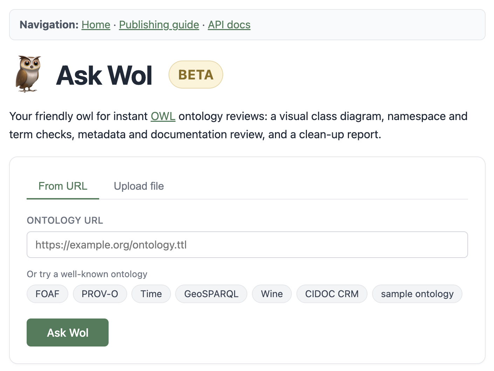

# askwol 🦉

> **Drop in an OWL ontology - get back a class diagram, namespace and term checks, metadata review, and a clean-up report. In seconds.**

[](LICENSE)
[](https://www.python.org/downloads/)
[](#tests)
[](https://fastapi.tiangolo.com/)

<!-- Once deployed, add a live link here:
👉 **Try it live:** https://askwol.example.com
-->

<p align="center">
  
</p>

## Why askwol?

The W3C originally planned to call their Web Ontology Language **WOL**. Tim Finin [proposed rearranging it to **OWL**](http://lists.w3.org/Archives/Public/www-webont-wg/2001Dec/0169.html) because *"owls are associated with wisdom."* Scrambling three letters is, of course, exactly what [Owl](https://en.wikipedia.org/wiki/Owl_(Winnie-the-Pooh)) from Milne's *Winnie-the-Pooh* is famous for. As Dave de Roure [first pointed out to the working group](https://lists.w3.org/Archives/Public/www-webont-wg/2002Sep/0301.html), Owl spells his own name **"Wol"**: *"wise though he was in many ways, able to read and write and spell his own name WOL, yet somehow went all to pieces over delicate words like MEASLES and BUTTEREDTOAST"* (Ch. 4, 1926).

So the name went WOL → OWL → and, for a tool that *asks* Owl for a wise second opinion on your ontology, back to **askwol**.

<p align="center">
  <a href="https://commons.wikimedia.org/wiki/File:Winnie-the-Pooh_67.png">
    
  </a>
</p>

## What do you get?

A single HTML report (or JSON via the API) with one section per automated check. Every section links to a matching entry in the built-in **publishing guide** at `/guide`, so a failing check always tells you *why* the convention exists.

1. **Ontology diagram** - an interactive class diagram showing classes, properties, and inheritance hierarchy (web UI). Zoom, pan, and explore.
2. **Ontology metadata** - SHACL check on the ontology header: title, description, creator, license IRI, version are required; created/modified dates and publisher are recommended.
3. **Imports** - external vocabularies actually used in the ontology must be declared with `owl:imports`. Core W3C vocabularies (RDF, RDFS, OWL, XSD) are excluded.
4. **IRI strategy** - the ontology's own defined terms should consistently use either hash (`#Term`) or slash (`/Term`), not both.
5. **IRI scheme** - each host should be referenced under a single URI scheme. `http://example.org/X` and `https://example.org/X` are different IRIs.
6. **Namespace resolution** - fetches each declared namespace URI, checks HTTP status, tries to parse as RDF (Turtle, RDF/XML, JSON-LD, N-Triples). Falls back to scanning HTML pages for RDF links.
7. **External term definitions** - verifies that terms reused from an external vocabulary are actually defined there. Catches typos like `owl:MadeUpClass` and made-up reuse of established prefixes.
8. **Internal term definitions** - flags terms in the ontology's own namespace that are referenced (as a predicate or object) but never defined (never appear as a subject). Usually a typo or a forgotten declaration.
9. **Labels** - SHACL check that every internally defined class and property carries an `rdfs:label`. Reused external terms are ignored.
10. **Comments** - SHACL check that every internally defined class and property carries an `rdfs:comment`. Reused external terms are ignored.
11. **Language tag consistency** - labels and definitions (`rdfs:label`, `rdfs:comment`, `skos:prefLabel`, `skos:definition`, ...) should use the same language tags across subjects.
12. **OWL RL reasoner checks** - lightweight reasoning on the current ontology (imports are not followed), with three distinct facets:
    - **Ontology consistency** - the ontology as a whole has a model.
    - **Inconsistent individuals** - specific named individuals that violate a class restriction (e.g. typed in two `owl:disjointWith` classes).
    - **Unsatisfiable classes** - named classes whose definition forces them to be empty (equivalent to `owl:Nothing`).
13. **Unused prefixes** - flags `@prefix` declarations that are never used in any triple.

## Quick start

The fastest way (no clone needed):

```bash
pipx install git+https://github.com/TDCC-NES/askwol.git
askwol check your-ontology.ttl
```

Or for development:

```bash
git clone https://github.com/TDCC-NES/askwol.git
cd askwol
python -m venv .venv
source .venv/bin/activate
pip install -e ".[dev]"   # Python 3.10+
```

### Start the web server

```bash
PYTHONPATH=src .venv/bin/uvicorn askwol.web:app --reload --port 8000
```

Then open:

- http://127.0.0.1:8000/ for the upload form
- http://127.0.0.1:8000/docs for the API docs

## Usage

```bash
# Rich terminal output
askwol check ontology.ttl

# Markdown / JSON report
askwol check ontology.ttl --format markdown -o report.md
askwol check ontology.ttl --format json

# Options
askwol check ontology.ttl --timeout 60        # default: 30s
askwol check ontology.ttl --skip-resolution   # parse only
```

Exit codes: `0` all pass, `1` issues found.

### Web UI

```bash
PYTHONPATH=src .venv/bin/uvicorn askwol.web:app --reload --port 8000
```

Endpoints: `GET /` (upload form), `POST /validate` (HTML report), `POST /api/validate` (JSON), `GET /guide` (publishing guide), `GET /health`, `GET /docs` (Swagger / OpenAPI).

## Deployment (Docker)

The repo ships with a `Dockerfile` and `docker-compose.yml` so the web app can be deployed on any Linux server with Docker.

### Run locally

```bash
# build and start detached
docker compose up -d --build

# rebuild AND recreate after code changes
# (plain `--build` can reuse the old container, leaving stale code running)
docker compose up -d --build --force-recreate

# logs / stop
docker compose logs -f askwol
docker compose down
```

Then open http://localhost:8000. If the page still looks stale after a rebuild,
hard-refresh the browser (Cmd/Ctrl+Shift+R) to clear cached assets.

#### Development with hot-reload

`docker-compose.override.yml.example` bind-mounts `src/` and runs uvicorn with
`--reload`. Copy it once and Compose merges it automatically:

```bash
cp docker-compose.override.yml.example docker-compose.override.yml
docker compose up --build      # first run, and whenever deps change
# edit files under src/askwol/ - uvicorn reloads on save
```

The override file is gitignored, so it never reaches the server.

### Deploy on a server

Prerequisites: a Linux host with Docker, a domain pointing to it, and a reverse proxy (e.g. [Caddy](https://caddyserver.com/) or nginx) for HTTPS.

```bash
# on the server
git clone https://github.com/TDCC-NES/askwol.git /opt/askwol
cd /opt/askwol
# do NOT copy docker-compose.override.yml.example here - without it, the
# production CMD from the Dockerfile (2 workers, no reload) is used.
docker compose up -d --build --force-recreate
```

The container binds to `127.0.0.1:8000` only. Point your reverse proxy at it, e.g. a minimal Caddyfile:

```caddy
askwol.example.com {
    encode zstd gzip
    request_body { max_size 25MB }
    reverse_proxy 127.0.0.1:8000
}
```

Caddy will obtain a Let's Encrypt certificate automatically. Updates:

```bash
cd /opt/askwol && git pull && docker compose up -d --build --force-recreate
```

`--force-recreate` guarantees the new image replaces the running container.
Logs: `docker compose logs -f askwol`.

#### Serving under a sub-path

If askwol sits at the root of a domain (`https://askwol.example.com/`), nothing
extra is needed.

If you serve it under a path prefix (e.g. `https://server/askwol/`), set
`ASKWOL_ROOT_PATH` to that prefix. askwol then rewrites its internal navigation
links to include the prefix (so Home, the publishing guide, the form, and the API
docs all resolve correctly, without relying on JavaScript or a trailing slash).

```yaml
# docker-compose.override.yml, or an .env file
environment:
  - ASKWOL_ROOT_PATH=/askwol
```

Point the reverse proxy at `127.0.0.1:8000` and strip the prefix before
forwarding, e.g. with Caddy:

```caddy
server.example.com {
    handle_path /askwol/* {
        reverse_proxy 127.0.0.1:8000
    }
}
```

Leave `ASKWOL_ROOT_PATH` empty for a root deployment.

**Security notes:** askwol fetches arbitrary URLs (namespace resolution + URL upload). On a public deployment, consider blocking outbound requests to private IP ranges to prevent SSRF, and keep the upload size cap on the reverse proxy.

### Usage tracking

A lightweight, privacy-friendly tracker logs each validation request to a local SQLite database. No cookies, no JavaScript, no third-party services. IPs are hashed with a per-database secret so they cannot be recovered from the stored data.

Recorded per event: timestamp, request kind (`validate` / `validate_upload`), source (the submitted URL or filename), HTTP status, duration in ms, and a truncated SHA-256 hash of the client IP.

Environment variables:

| Variable | Default | Purpose |
| --- | --- | --- |
| `ASKWOL_USAGE_DB` | `data/usage.db` | Path to the SQLite file. Local runs and the Docker setup both write here (`/data/usage.db` in the container maps to `./data/` on the host). |
| `ASKWOL_STATS_TOKEN` | *(unset)* | Required to view the `/stats` JSON dashboard. If unset, `/stats` returns 503. |
| `ASKWOL_USAGE_DISABLED` | *(unset)* | Set to `1` to disable tracking entirely. |

Enable the dashboard:

```bash
echo "ASKWOL_STATS_TOKEN=$(openssl rand -hex 32)" >> .env
docker compose up -d
curl "http://127.0.0.1:8000/stats?token=$(grep ASKWOL_STATS_TOKEN .env | cut -d= -f2)"
```

Returns aggregated counts for the last 30 days: total events, unique IP hashes, events per day, per status, and the top requested sources.

### Python API

```python
import asyncio
from askwol.parser import parse_ontology
from askwol.cache import OntologyCache
from askwol.resolver import resolve_all_namespaces
from askwol.term_validator import validate_terms

parsed = parse_ontology("ontology.ttl")
cache = OntologyCache()
checks = asyncio.run(resolve_all_namespaces(parsed.namespaces, cache))

for prefix, uri in parsed.namespaces.items():
    for r in validate_terms(prefix, uri, parsed.terms_by_namespace.get(prefix, set()), cache):
        print(f"{r.prefix}:{r.local_name} -> {r.status}")
```

## Supported formats

Turtle (`.ttl`), RDF/XML (`.rdf`, `.owl`), JSON-LD (`.jsonld`), N-Triples (`.nt`), N3 (`.n3`)

## Project structure

```
src/askwol/
├── cli.py                # Click CLI
├── web.py                # FastAPI app, routes, orchestration
├── parser.py             # rdflib ontology parsing
├── resolver.py           # async HTTP namespace resolution
├── term_validator.py     # remote term existence checks
├── metadata_validator.py # SHACL-based ontology metadata checks
├── definition_docs.py    # SHACL-based definition documentation checks
├── imports_check.py      # owl:imports completeness check
├── iri_strategy.py       # hash vs slash IRI consistency
├── iri_scheme.py         # http vs https per-host consistency
├── lang_tags.py          # language-tag consistency checks
├── reasoner_checks.py    # OWL RL reasoning sanity checks
├── mermaid_diagram.py    # interactive class diagram
├── cache.py              # in-memory ontology cache
├── models.py             # Pydantic models
├── report.py             # CLI / markdown output
├── report_html.py        # HTML report rendering (CHECKS registry)
├── templates.py          # publishing guide content (GUIDE_SECTIONS)
├── usage.py              # privacy-friendly request tracking (SQLite)
└── shapes/               # SHACL shapes (metadata + documentation)

tests/
├── test_*.py             # unit + integration tests

examples/
├── sample.ttl            # clean ontology - every check passes
└── broken.ttl            # deliberately broken - every check fires
```

The HTML report sections and the publishing guide are kept in lockstep by an
import-time `assert` in `report_html.py`: the `CHECKS` registry and the
`group="check"` entries in `GUIDE_SECTIONS` must list the same anchors in the
same order, otherwise the module fails to load (and the test suite catches it).

## Tests

```bash
pytest tests/ -v
```

82 tests cover every automated check on both good and bad inputs, the HTML
report rendering, the FastAPI routes via `TestClient`, and a pinned end-to-end
smoke test on [`examples/broken.ttl`](examples/broken.ttl) that fails loudly
if any single check ever stops detecting issues. The clean counterpart is
[`examples/sample.ttl`](examples/sample.ttl). Drop either one into the upload
form at http://localhost:8000/ to see the report end to end.

## License

MIT
